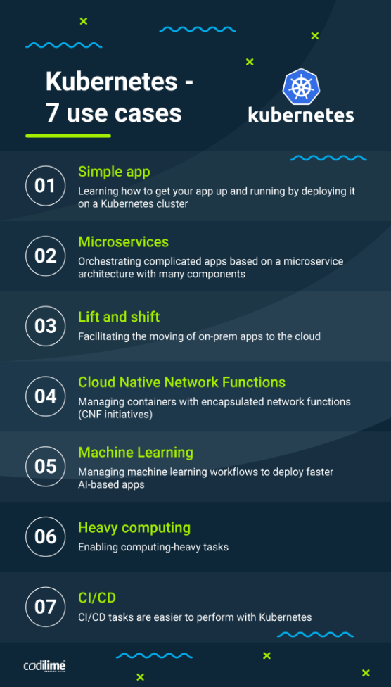

# Kubernetes (K8)

Kubernetes is an orchestration tool used to cluster groups of hosts running Linux tonainers and manage these containers in terms of automating computer application deployment, scaling, and management. 

What can K8 do for you:
- Self heals
- Load balance and Service Discovery
- Automated rollouts and rollback
- Auto scaling
- Automatic bin packing
- Sotrage orchestration

**Adapt a micro service architecture: start small with 1 / 2 services with small teams test, learn and move own**

**Docker to containerise apps for fast and consistent delivery**

**Orchestration with K8 to make life easy**

### Why should we use it

Kubernetes should be used to group together a collection of containers (can be docker containers) and control resources allocating and manage cloud applications for these groups of containers. It should be used because it allows us to automate the steps of orchestration and dealing with containers.

### Use Cases

<p align="center">
  
</p>

[Kubernetes Use Cases [Resource]](https://codilime.com/blog/harnessing-the-power-of-kubernetes-7-use-cases)

## When not to use Kubernetes

**Kubernetes can be overkill for simple apps**

If you are building a simple application that wont be distributed to a large audience or allocating lots of resources you do not need K8. This is because its a complex technolgoy that is meant to run software in cloud environemtn at a massive scale. 

## Competitors

- Amazon Elastic Container Service (Amazon ECS)
- Mirantis Kubernetes Engine (formerly Docker Enterprise)
- G2 Deals
- Google Kubernetes Engine (GKE)
- Red Hat OpenShift Container Platform
- Azure Kubernetes Service (AKS)
- SaltStack
- Rancher
- Portainer
- Amazon Elastic Kubernetes Service (Amazon EKS)
- Cloud Foundry

### App Deploy

```YML
apiVersion: apps/v1
kind: Deployment
metadata:
  name: app-deployment

spec:
  selector:
    matchLabels:
      app: nodejs
  replicas: 2
  template: 
    metadata:
      labels:
        app: nodejs
    spec:
      containers:
        - name: k8-app
          image: mueed/eng89_app:v3
          ports:
          - containerPort: 3000
```
### App Service
```YML
apiVersion: v1
kind: Service
metadata:
  name: nginx-deployment
  namespace: default
  resourceVersion: "40883"
  uid: 9190ab75-d61c-4ff4-a3d1-0d293fa8d72e
spec:
  # clusterIP: 10.96.0.1
  # clusterIPs:
  # - 10.96.0.1
  # externalTrafficPolicy: Cluster
  # ipFamilies:
  # - IPv4
  # ipFamilyPolicy: SingleStack
  ports:
  - nodePort: 30442
    port: 80
    protocol: TCP
    targetPort: 80
  selector:
    app: nginx
  sessionAffinity: None
  type: LoadBalancer
status:
  loadBalancer:
    ingress:
    - hostname: localhost
```