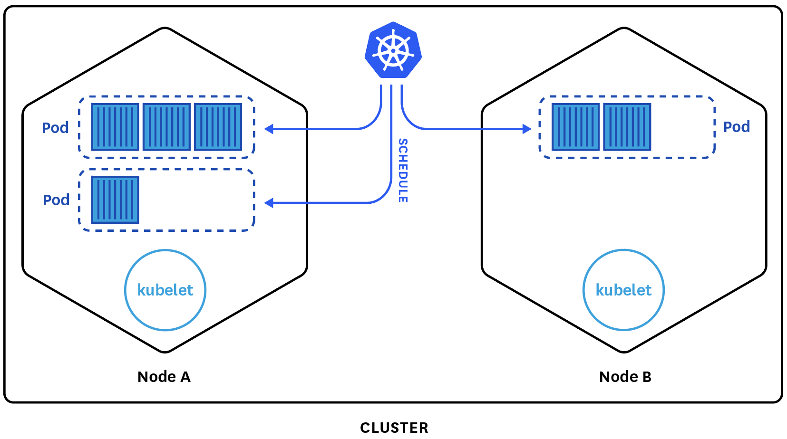
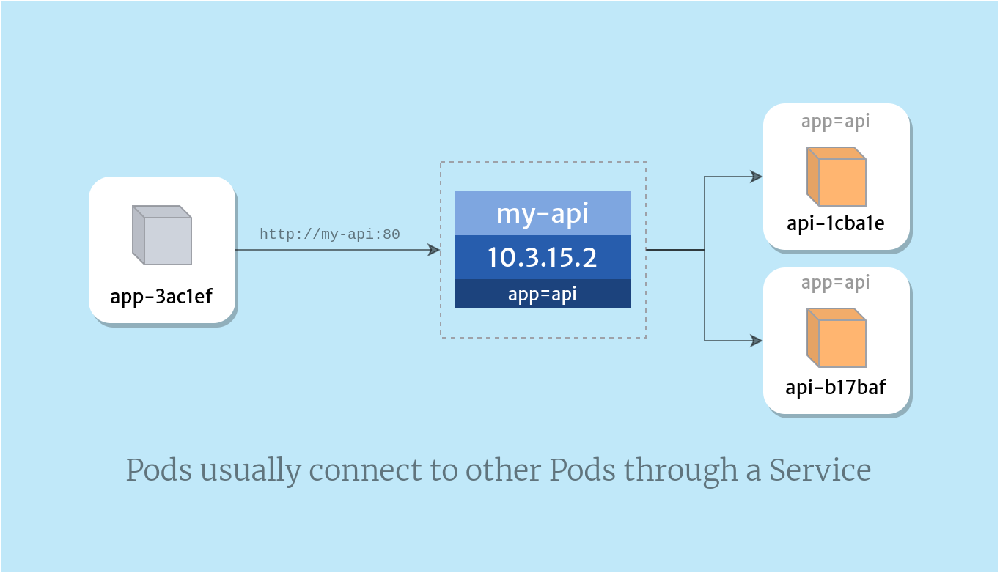

# Kubernetes (K8)

Kubernetes is an orchestration tool used to cluster groups of hosts running Linux tonainers and manage these containers in terms of automating computer application deployment, scaling, and management. 

What can K8 do for you:
- Self heals
- Load balance and Service Discovery
- Automated rollouts and rollback
- Auto scaling
- Automatic bin packing
- Sotrage orchestration

**Adapt a micro service architecture: start small with 1 / 2 services with small teams test, learn and move own**

**Docker to containerise apps for fast and consistent delivery**

**Orchestration with K8 to make life easy**

### Why should we use it

Kubernetes should be used to group together a collection of containers (can be docker containers) and control resources allocating and manage cloud applications for these groups of containers. It should be used because it allows us to automate the steps of orchestration and dealing with containers.

### Use Cases

<p align="center">
  
</p>

[Kubernetes Use Cases [Resource]](https://codilime.com/blog/harnessing-the-power-of-kubernetes-7-use-cases)

## When not to use Kubernetes

**Kubernetes can be overkill for simple apps**

If you are building a simple application that wont be distributed to a large audience or allocating lots of resources you do not need K8. This is because its a complex technolgoy that is meant to run software in cloud environemtn at a massive scale. 

## Competitors

- Amazon Elastic Container Service (Amazon ECS)
- Mirantis Kubernetes Engine (formerly Docker Enterprise)
- G2 Deals
- Google Kubernetes Engine (GKE)
- Red Hat OpenShift Container Platform
- Azure Kubernetes Service (AKS)
- SaltStack
- Rancher
- Portainer
- Amazon Elastic Kubernetes Service (Amazon EKS)
- Cloud Foundry

### App Deploy

```YML
apiVersion: apps/v1
kind: Deployment
metadata:
  name: app-deployment

spec:
  selector:
    matchLabels:
      app: nodejs
  replicas: 2
  template: 
    metadata:
      labels:
        app: nodejs
    spec:
      containers:
        - name: k8-app
          image: mueed/eng89_app:v3
          ports:
          - containerPort: 3000
```
### App Service
```YML
apiVersion: v1
kind: Service
metadata:
  name: nginx-deployment
  namespace: default
  resourceVersion: "40883"
  uid: 9190ab75-d61c-4ff4-a3d1-0d293fa8d72e
spec:
  # clusterIP: 10.96.0.1
  # clusterIPs:
  # - 10.96.0.1
  # externalTrafficPolicy: Cluster
  # ipFamilies:
  # - IPv4
  # ipFamilyPolicy: SingleStack
  ports:
  - nodePort: 30442
    port: 80
    protocol: TCP
    targetPort: 80
  selector:
    app: nginx
  sessionAffinity: None
  type: LoadBalancer
status:
  loadBalancer:
    ingress:
    - hostname: localhost
```
# Updated Code
mongo-development.yml
```YML
apiVersion: v1
kind: PersistentVolumeClaim
metadata:
  name: mongo-db
spec:
  accessModes:
    - ReadWriteOnce
  resources:
    requests:
      storage: 256Mi
---
apiVersion: v1
kind: Service
metadata:
  name: mongo
spec:
  selector:
    app: mongo
  ports:
    - port: 27017
      targetPort: 27017
---
apiVersion: apps/v1
kind: Deployment
metadata:
  name: mongo
spec:
  selector:
    matchLabels:
      app: mongo
  replicas: 1
  template:
    metadata:
      labels:
        app: mongo
    spec:
      containers:
        - name: mongo
          image: mongo
          ports:
            - containerPort: 27017
          volumeMounts:
            - name: storage
              mountPath: /data/db
      volumes:
        - name: storage
          persistentVolumeClaim:
            claimName: mongo-db
```
nginx-deployment.yml
```YML
apiVersion: apps/v1
kind: Deployment
metadata:
  name: node
spec:
  selector:
    matchLabels:
      app: node
  replicas: 3
  template: 
    metadata:
      labels:
        app: node
    spec:
      containers:
        - name: node
          image: monotiller/eng89_node_app
          ports:
            - containerPort: 3000
          env:
            - name: DB_HOST
              value: mongodb://mongo:27017/posts
          # command: [""]
          # args: ["node","seeds/seed.js"]
          imagePullPolicy: Always
---
apiVersion: v1
kind: Service
metadata:
  name: node
spec:
  selector:
    app: node
  ports:
    - port: 3000
      targetPort: 3000
  type: LoadBalancer 
```
Auto scaling
```YML
apiVersion: autoscaling/v1
kind: HorizontalPodAutoscaler

metadata:
  name: node-app-hpa
  namespace: default

# set your auto-scaling min and max numbers
spec:
  maxReplicas: 9
  minReplicas: 2
  # target your node-app-deployment so the hpa knows which
  # deployment to scale up on demand, scales down when no longer needed
  scaleTargetRef:
    apiVersion: apps/v1
    kind: Deployment
    name: node-app
  targetCPUUtilizationPercentage: 50
  ```
cronjob
```YML
apiVersion: batch/v1
kind: CronJob
metadata:
  name: eng89
spec:
  schedule: "*/1 * * * *"
  jobTemplate:
    spec:
      template:
        spec:
          containers:
          - name: eng89
          image: busybox
          imagePullPolicy: IfNotPresent
          command:
          - /bin/sh
          - c
          - date; echo thank you for using cronjob

          restartPolicy: OnFailure
```

<h3> What is cronjob? </h3>

he cron daemon is a long-running process that executes commands at specific dates and times. You can use this to schedule activities, either as one-time events or as recurring tasks. To schedule one-time only tasks with cron, use the at or batch command.

Use cases :
- scale application based on load (using multiple custom metrics)
- check the availability of everything (internally + externally)
- backup databases on our cloud provider
- backup encrypted databases on a different cloud provider (as S3 object)
- Various maintenance tasks

```

# Cron schedule syntax
#      ┌────────────────── timezone (optional)
#      |      ┌───────────── minute (0 - 59)
#      |      │ ┌───────────── hour (0 - 23)
#      |      │ │ ┌───────────── day of the month (1 - 31)
#      |      │ │ │ ┌───────────── month (1 - 12)
#      |      │ │ │ │ ┌───────────── day of the week (0 - 6) (Sunday to Saturday;
#      |      │ │ │ │ │                                   7 is also Sunday on some systems)
#      |      │ │ │ │ │
#      |      │ │ │ │ │
# CRON_TZ=UTC * * * * *
```

`# kubectl apply -f cron-job.yml`

`# kubectl get cronjob`

`# kubectl get job --watch`

`# pods=$(kubectl get pods --selector=job-name=eng89-27163577  --output=jsonpath={.items[*].metadata name})`



- ClusterIP. Exposes a service which is only accessible from within the cluster.
- NodePort. Exposes a service via a static port on each node’s IP.
- LoadBalancer. Exposes the service via the cloud provider’s load balancer.
- ExternalName. Maps a service to a predefined externalName field by returning a value for the CNAME record.

**NodePort port range** - 30000-32767

